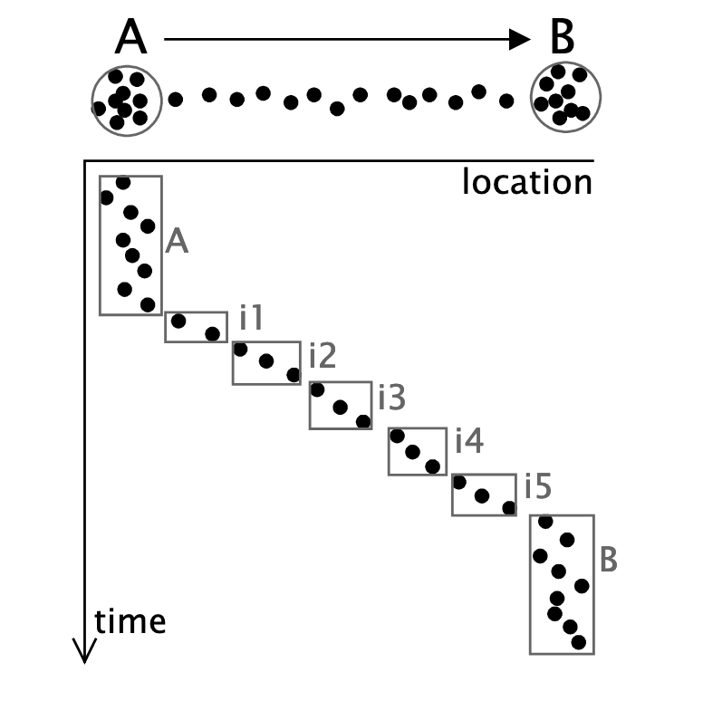

```{r global_options, include=FALSE}

knitr::opts_chunk$set(error=TRUE,        # Keep compiling upon error
                      cache=FALSE,       # don't cache anythin by default
                      collapse=FALSE,    # collapse by default
                      echo=TRUE,         # echo code by default
                      comment = "#>",    # change comment character
                      fig.align='center',
                      # fig.width = 5,     # set figure width
                      out.width = "100%", # set width of displayed images
                      warning=FALSE,     # do not show R warnings
                      message=FALSE)     # do not show R messages
```


## Intro

Location information is crucial for analyzing sensor data and extracting behavioral inferences from mobile and wearable devices. In particular, the ubiquity of [Global Positioning System (GPS)](https://en.wikipedia.org/wiki/Global_Positioning_System) sensors in smartphones allows us to gather this information continuously in real-time.

Let's say you are interested in monitoring your stress levels throughout the day. Location and time are crucial to addressing the problem. You might find you are more stressed during the day at school due to mounting courseloads or perhaps at home during the weekends due to perceived isolation. But how do we take location data and transform it in a way that helps us extract these insights?

Simply describing the raw is not particularly meaningful (e.g. “User at 40.00002N, 116.3274W at 7pm on 7/5/2009”). While this description is accurate, it is not descriptive of any meaningful activities. Thus, we need to describe the data in a way the average person might consider significant, such as describing where someone spends their time.

In this tutorial, I present some examples of how clustering methods can be applied to turn raw GPS data into meaningful location information.

## Dataset

### Required Packages

```{r echo=FALSE}
library(RColorBrewer)
col = colorRampPalette(brewer.pal(n = 9, name = "Set1"))(15)
```

### Data Import

The data used in this tutorial comes from the [(Microsoft Research Asia) GeoLife Dataset](https://www.microsoft.com/en-us/download/details.aspx?id=52367). The GeoLife GPS trajectory dataset was collected by 182 users in a period of over three years (from April 2007 to August 2012). It contains 17,621 trajectories with a total distance of about 1.2 million kilometers and a total duration of 48,000+ hours.

```{r}
library(tidyverse)
file_list <- list.files("~/Downloads/Geolife Trajectories 1.3/Data/000/Trajectory", full=T)
file_con <- lapply(file_list, function(x){
  return(read.table(x, head=F, quote = "\"", skip = 6, sep = ","))
})
df <- do.call(rbind, file_con)[-c(3,4,5)]
colnames(df) <- c("Latitude","Longitude","Date","Time")
```

In order to demonstrate the higher-level concepts related to clustering GPS trajectories, I will work with only 500 records out of the `r nrow(df)` available in the current sample. The dataset also includes altitude and epoch (days since 12/30/1899) but these columns have been excluded in the current analysis.

```{r}
num_pts = 1500
loc_df <- tail(df,num_pts)
```

```{r, echo=FALSE}
knitr::kable(tail(df, 5))
```

```{r}
library(leaflet)

base.map <- leaflet(data=loc_df) %>% addTiles() %>% addProviderTiles(providers$CartoDB.Positron)
base.map %>%
  addCircleMarkers(
    ~Longitude, ~Latitude,
    radius = 5,
    stroke = FALSE,
    fillOpacity = 0.5
)
```


## Clustering GPS Trajectories

### Spatial Clustering

In the context of data mining, clustering is the process of grouping similar observations together into clusters such that similarity within groups is maximized and similarity between groups is minimized. There are a wide variety of algorithms for clustering, which typically rely on some measure of distance or dissimilarity between observations. In the case of spatial data, the obvious choice is to cluster based on the actual physical distance between the points. R has a variety of methods for this task, I demonstrate two: K-means clustering and DBSCAN.

#### K-Means

While we have discussed the K-means clustering algorithm in class, I would like to re-adress it here in the context of its performance on GPS trajectory data. For those viewing this tutorial who have not taken the class or would like a refresher on how K-means works, I provided a summary below:

The key parameter that you have to select for K-means is *K*, the number of clusters. *K* is typically chosen based on the number of clusters we expect in the data (e.g. # of possible values the target outcome can take).

Given *K*, the k-means algorithm consists of an iterative algorithm with four steps

1. Select *K* initial centroids at random from the points.

2. **repeat** 
  + Assign each data point to the cluster with the nearest centroid (in terms of distance).
  + Re-compute each centroid as the mean of the data points assigned to it.
  
3. **until** centroids do not change


```{r}
num_clusters = 5
kclust <- kmeans(loc_df[,c("Latitude","Longitude")], num_clusters)
```

```{r}

base.map %>%
  addCircleMarkers(
    ~Longitude, ~Latitude,
    radius = 5,
    color = as.vector(sapply(kclust$cluster, function(z) col[z])),
    stroke = FALSE,
    fillOpacity = 0.5
  )

```


While K-means successfully separated the data into `r num_clusters` clusters, the resulting clusters are hard to interpret in terms of significant location patterns.  

As you can see in the map above, K-means clustering assumes that clusters are roughly similarly sized. However, location trajectories are not implicitly equivalent in density or size. For example, the amount of time and distance traveled are not the same when someone commutes from work to home as compared with shopping. Furthermore, K-means is not good at dealing with irregular cluster shapes. This stems from the fact that the centroid of a cluster is calculated as the mean over all the points in that cluster, which assumes a globular cluster shape.

These factors contribute to why K-means produces suboptimal clusterings in this application, although it is fast and really easy to to implement.


#### DBSCAN

[Density-based spatial clustering of applications with noise (DBSCAN)](https://en.wikipedia.org/wiki/DBSCAN) is a density-based clustering algorithm, meaning that clusters are defined as contiguous areas of high density. This is in contrast to methods such as k-means clustering, which are based on distance between observations. This approach makes intuitive sense because humans typically identify clusters of points visually based on density.

DBSCAN uses two parameters to define what constitutes a cluster: minPts and \(\epsilon\). Specifically, a cluster is defined as a group of at least minPts points that are all within \(\epsilon\) distance of each other (or less). 


```{r include=FALSE}
library(geosphere)
dist = loc_df %>%
  mutate(longlead = lead(Longitude), latlead = lead(Latitude)) %>%
  na.omit() %>%
  rowwise() %>%
  mutate(dist = distCosine(c(Longitude,Latitude), c(longlead, latlead))) %>%
  pull(dist)

```


```{r}
library(dbscan)
db<-dbscan(loc_df[,c("Latitude","Longitude")], eps = 0.002, minPts = 20)

base.map %>%
  addCircleMarkers(
    ~Longitude, ~Latitude,
    radius = 5,
    color = sapply(db$cluster, function(z) col[z]),
    stroke = FALSE,
    fillOpacity = 0.5
)
```

DBSCAN found `r n_distinct(db$cluster)` clusters in the data. The black points in the visual above do not belong to a cluster and instead indicate noise points. 


As shown on the map, DBSCAN was able to more flexibly indentify clusters and is not limited by a pre-set defintion of how many clusters may exists. However, the weakness of this method is that it is not centroid-based. That is the regions identified are not globular and thus taking the mean of all the points belonging to a given cluster may not result in a representative data point by which to label the cluster semantically.


### Temporal Clustering

The methods described above account for the spatial dimensions. However, this kind of data also has a temporal dimension to it. Each record has a corresponding date and time, and we ultimately want to preserve the temporal ordering of the data. Below, I describe one method used by researchers to address the temporal dimension of GPS trajectory data [@kang2004extracting, @boukhechba2018predicting].

Kang et al. proposed a time-based approach cluster the stream of incoming location coordinates along the time axis and drops smaller clusters where little time is spent. Specifically, they compare each incoming coordinate with previous coordinates in the current cluster; if the stream of coordinates moves away from the current cluster then we form a new one.

```{r pressure, echo=FALSE, fig.cap="Illustration of clustering approach (Fig. 3 from Kang et al.)", out.width = '50%'}

```

A pseudocode description in provided in the paper. I have also provided some pseudocode in R below for reference.

```{r eval=FALSE}

# ---------- PARAMETERS ------------

# d = distance threshold
# t = time threshold
# l = outlier time threshold (amount of time spent out of cluster before algorithm creates a new cluster)
# cl = set of coordinates in the current cluster
# plocs = list of pending coordinates we use to filter outliers
# Places = set of significant places

# ---------- ALGORITHM PSEUDOCODE ------------

for (loc in temporally.ordered.data) {
  
  if (dist(loc, center.of.cl) <= d) {
    cl <- append(cl,loc)
  } else {
    
    if (length(plocs) > l) {
      
      if (loc$duration > t) {
        Places <- append(Places, loc)
      }
      
      cl <- c(plocs[l+1])
      plocs <- c()
      
      if (dist(loc, center.of.cl) <= d) {
        cl <- append(cl, loc)
      } else {
        Places <- append(Places, loc)
      }
      
    } else {
      Places <- append(Places, loc)
    }
    
  }
  
}

```


### Semantic Labels

Once clusters have been identified, we can aggregate all the points within each cluster to a single point. 
This point will serve as a marker by which to semantically label the group to which is belongs. Here I take the mean of the coordinates to represent all the points within the cluster.

```{r}
centroids <- as.data.frame(kclust$centers)

leaflet(data=centroids) %>% addTiles() %>% addProviderTiles(providers$CartoDB.Positron) %>%
  addCircleMarkers(
    ~Longitude, ~Latitude,
    radius = 10,
    stroke = FALSE,
    fillOpacity = 0.5
)

```


Using the *revgeo* library, we can convert the raw latitude and longitude pairs into meaningful geographic information (e.g. address, street, city, country). I use the Photon geocoder for OpenStreetMap below, but GoogleMaps and Bing are also supported provided you have an API key. 

```{r results='hide'}
library(revgeo)
revgeo.code <- revgeo(centroids$Longitude, centroids$Latitude, provider =  'photon', output = 'frame') %>% 
    mutate(country = as.character(country), location = paste(city, state, sep = ", "))
```

```{r echo=FALSE}
knitr::kable(revgeo.code)
```

While the *revgeo* library does not provide information beyond address, Boukhechba et al. have shown that OpenStreetMap in conjunction with the time-based clustering algorithm developed by Kang et al. can be used to identify more subjective location types (e.g. education, home, friends houses).


## TL;DR: Pros & Cons

**Spatial Clustering**

  * **K-means**
    + Pros: Fast, easy to implement
    + Cons: Strict assumptions that don't translate well to geospatial data
  * **DBSCAN**
    + Pros: Versatile, efficient, less assumptions than K-means
    + Cons: Lack of centroids makes clusters hard to aggregate
    
**Temporal Clustering**  

  * **Kang et al.**
    + Pros: Accounts for both time and space dimensions, flexible number of clusters
    + Cons: Less efficient, does not seem to account for revisited locations
    

## References

[(Microsoft Research Asia) GeoLife Dataset](https://www.microsoft.com/en-us/download/details.aspx?id=52367)

[http://web.cs.wpi.edu/~emmanuel/courses/cs528/F18/slides/papers/deepak_ganesan_GPS_clustering.pdf](http://web.cs.wpi.edu/~emmanuel/courses/cs528/F18/slides/papers/deepak_ganesan_GPS_clustering.pdf)

[http://strimas.com/spatial/big-year-route/](http://strimas.com/spatial/big-year-route/)


